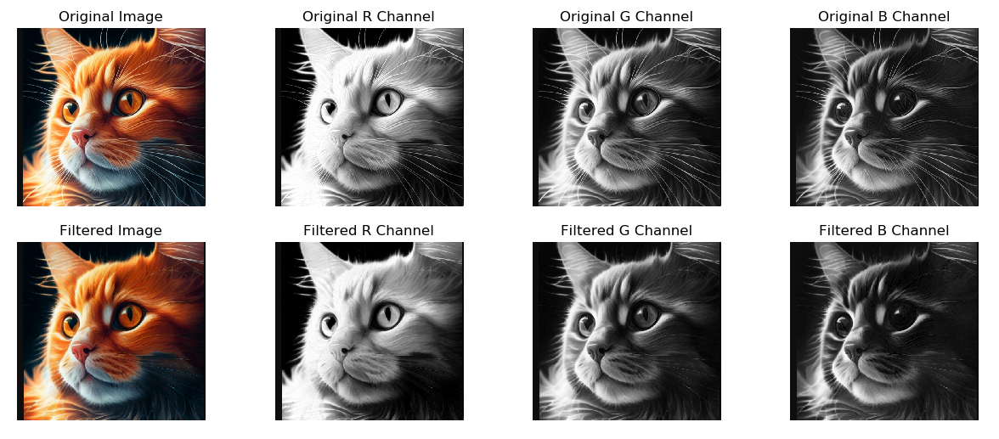
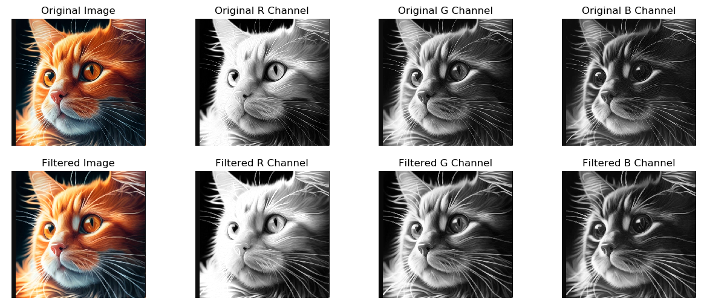
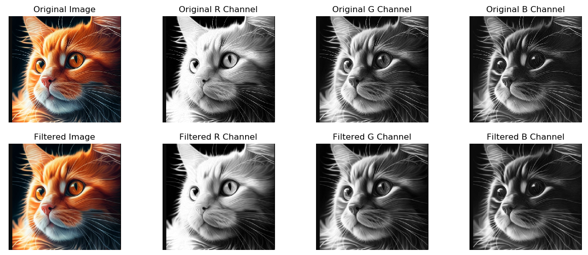

# Computer Vision Lab 1: Implementing Filters from Scratch 
## Introduction: 
This lab focuses on building fundamental image processing filters from scratch using only NumPy for calculations and Matplotlib for visualization. The goal is to gain a deep understanding of how filters work at a pixel level, rather than relying on high-level libraries like OpenCV.
In this lab, it was nessessary to implement the following filters:
1. Erosion
2. Dilation
3. Median
4. Gaussian
5. Lighting correction
6. Gamma correction
7. Binarization

## RGB Channel Filtering
Each filter is applied independently to the Red (R), Green (G), and Blue (B) channels of the image. The workflow is as follows:
1. Split the RGB image into its three channels: R, G, B.
2. Apply the filter to each channel separately.
3. Merge the processed channels back together to form the final filtered RGB image.

This method ensures that the effect of the filters is reflected in the composite image while preserving the color relationships between channels.

## Implemented filters:
### 1. Erosion Filter
Erosion reduces the boundaries of the foreground object by applying a minimum filter. It is useful for removing small white noise and separating two connected objects. 

**Mathematical Formula**:

$$\
E(x,y) = \min_{(i,j) \in K} I(x+i, y+j)
\$$

Where:
- $\ E(x,y)\$: the eroded pixel value at position \$(x,y)\$
- $\ I(x+i, y+j) \$: pixel values in the neighborhood defined by the kernel $\ K \$
- $\ K \$: the structuring element (kernel) used to probe the image

**Code implementation**: The kernel slides over the image, and at each position, the minimum pixel value within the kernel's area is taken as the output. This shrinks bright regions and enlarges dark regions. 
See `erode()` function in `lab1.py`.

**Results**: After Erosion, bright areaes are shunk, especially noticeable in the R channel (due to the orange color of the cat's fur). Fine details and white noise are also removed or reduced. Dark areas become more prominent due to the shrinkage of the highlights.

### 2. Dilation Filter
Dilation adds pixels to the boundaries of objects by applying a maximum filter. It helps to connect broken parts of an object.

**Mathematical Formula**:

$$\
D(x,y) = \max_{(i,j) \in K} I(x+i, y+j)
\$$

Where:
- $\ D(x,y)\$: the dilated pixel value at position \$(x,y)\$
- $\ I(x+i, y+j) \$: pixel values in the neighborhood defined by the kernel $\ K \$
- $\ K \$: the structuring element (kernel) used to probe the image

**Code implementation**: The kernel moves across the image, and at each position, the maximum pixel value within the kernel is taken as the output. This enlarges bright regions and shrinks dark ones.
See `dilate()` function in `lab1.py`

**Results**: Dilation has the opposite effect of erosion; it expands bright regions and shrinks dark areas:
- Edges and small bright details have become more pronounced compared to the original image.
- Thin lines and bright regions appear thicker, making features like whiskers or fur more prominent.
- Dark areas have been reduced, and bright areas have expanded, improving visibility in certain regions.

### 3. Median Filter
The median filter replaces each pixel with the median value of its neighbors. This is particularly effective in removing salt-and-pepper noise.

**Mathematical Formula**:

$$\
M(x,y) = \text{median}\{I(x+i, y+j) | (i,j) \in K\}
\$$

**Code implementation**: For each pixel, the values in its neighborhood are sorted, and the median value is assigned to the central pixel.
See `median()` function in `lab1.py`

**Results**: The median filter effectively removes salt-and-pepper noise by replacing extreme pixel values with more representative values from their neighborhood. The filtered result shows:
- Reduced noise in all RGB channels.
- Smoother color transitions without blurring sharp edges.

### 4. Gaussian filter
Gaussian filtering applies a convolution with a Gaussian kernel, smoothing the image and reducing high-frequency noise.

**Mathematical Formula**:

$$\
G(x,y) = \sum_{i,j} I(x+i, y+j) \cdot K(i,j)
\$$

The Gaussian kernel  is calculated as:

$$\
K(i,j) = \frac{1}{2\pi\sigma^2} e^{-\frac{i^2 + j^2}{2\sigma^2}}
\$$

where:
- $\ G(x,y)\$: the output pixel value after Gaussian filtering at position 
- $\ I(x+i, y+j)\$: the pixel value at position  in the input image
- $\ K(i,j)\$: the Gaussian kernel value at position 
- $\sigma$ : the standard deviation of the Gaussian distribution, controlling the amount of blur

**Effect of $\sigma$**:
- A **small $\sigma$**results in a narrow Gaussian kernel, causing minimal blurring and preserving more details.
- A **large $\sigma$** produces a wider kernel, leading to stronger blurring and smoother results, but at the cost of losing fine details.

**Code implementation**: The kernel is a 2D bell-shaped curve that gives more weight to central pixels and less to distant ones, resulting in a soft blurring effect.
See `gaussian()` function in `lab1.py`

**Results**: After Gaussian filter:
Based on the image processed with the Gaussian filter:
- The filtered image appears smoother, with fine details like the cat's fur and eye edges slightly blurred.
- The major outlines and shapes of the cat remain clear, indicating that the Gaussian filter blurs softly without completely erasing important details.
- When comparing each color channel, small noise is reduced, but the contrast between different regions of color is reasonably preserved.

### 5. Lighting correction
Adjusts the image brightness linearly by multiplying pixel values by a brightness factor.

**Mathematical Formula**:

$$\
L(x,y) = clip(I(x,y) \times b, 0, 255)
\$$

** Choosing the Brightness Factor**:
- A brightness factor greater than 1 brightens the image.
- A brightness factor less than 1 darkens the image.
- A factor of 1 keeps the image unchanged.

**Code implementation**: Each pixel value is scaled by a constant factor, and values are clamped to the range [0, 255]. This is effective for uniformly brightening or darkening an image.
See `ligjting_correction()` function in `lab1.py`

**Results**: The lighting correction filter has clearly brightened the image by scaling pixel intensities
- The filtered image is noticeably lighter compared to the original, with brighter highlights and more vibrant colors.
- All RGB channels show an increase in intensity, making the cat's fur and whiskers stand out more distinctly.
- The boosted brightness has also enhanced the contrast, especially in the R (Red) channel, causing some regions to appear overexposed — evident from the white patches in the filtered R, G, and B channels.

### 6. Gamma correction
Gamma correction adjusts pixel intensity non-linearly, making dark pixels lighter or light pixels darker based on a gamma factor $\gamma$.

**Mathematical Formula**:

$$\
G(x,y) = 255 \times \left( \frac{I(x,y)}{255} \right)^{\gamma}
\$$

**Choosing the Gamma Value**:
- $\gamma > 1\$: Darkens the image, emphasizing details in bright regions.
- $\gamma < 1\$ : Lightens the image, revealing details in darker areas.
- $\gamma = 1\$ : No change to the image.

**Code implementation**: 
See `gamma_correction()` function in `lab1.py`

**Results**: With $\gamma = 0.5\$: 
- The image appears brighter, it increases the intensity of mid-tones and shadows, lightening darker regions.
- Highlights become even more pronounced, and contrast may be reduced
- Gamma correction retains more nuance in lighter areas, whereas lighting correction may lead to overexposure

Based on the histogram of the color channels after applying gamma correction, can see that:

- Previously dark pixels have been "pushed" to the right side of the histogram, making the overall image appear brighter.
- The histograms show a higher frequency of pixel values near 255, clearly indicating that details in dark regions have been enhanced.
- The spacing between histogram bars in the darker regions becomes more pronounced, showing an increase in detail visibility in low-intensity areas.
  

### 7. Binarization
Binarization converts a grayscale image into a binary image, where each pixel is either black or white.

**Mathematical Formula**:

$$\
B(x,y) = \begin{cases} 
    255 & \text{if } I(x,y) > T \\ 
    0 & \text{if } I(x,y) \leq T 
\end{cases}
\$$

**Code implementation**: 
See `binarization()` function in `lab1.py`

**Results**: After applying Binarization to the image:
- In the R, G, B channels after binarization, prominent details — especially edges and high-contrast areas — become more visible.
- All color information and intermediate grayscale levels are removed, making the image very simplified, retaining only the basic structure.
  

## Conclusion
Through the implementation of various filters — Erosion, Dilation, Median, Gaussian, Lighting correction, Gamma correction, and Binarization — we have explored key image processing techniques used in computer vision. Each filter serves a unique purpose:
- **Erosion**: Shrinks white regions, removing noise and small white areas.
- **Dilation**: Expands white regions, filling gaps and connecting components.
- **Median Filter**: Reduces salt-and-pepper noise by replacing each pixel with the median value of its neighborhood.
- **Gaussian Filter**: Smooths images, reducing high-frequency noise using a Gaussian kernel.
- **Lighting Correction**: Adjusts for non-uniform lighting, enhancing image clarity.
- **Gamma Correction**: Modifies image brightness non-linearly, useful for detail enhancement in shadows or highlights.
- **Binarization**: Converts grayscale images to binary, highlighting edges and high-contrast areas.
Understanding and implementing these filters from scratch builds a strong foundation for tackling more complex image processing and computer vision tasks.
